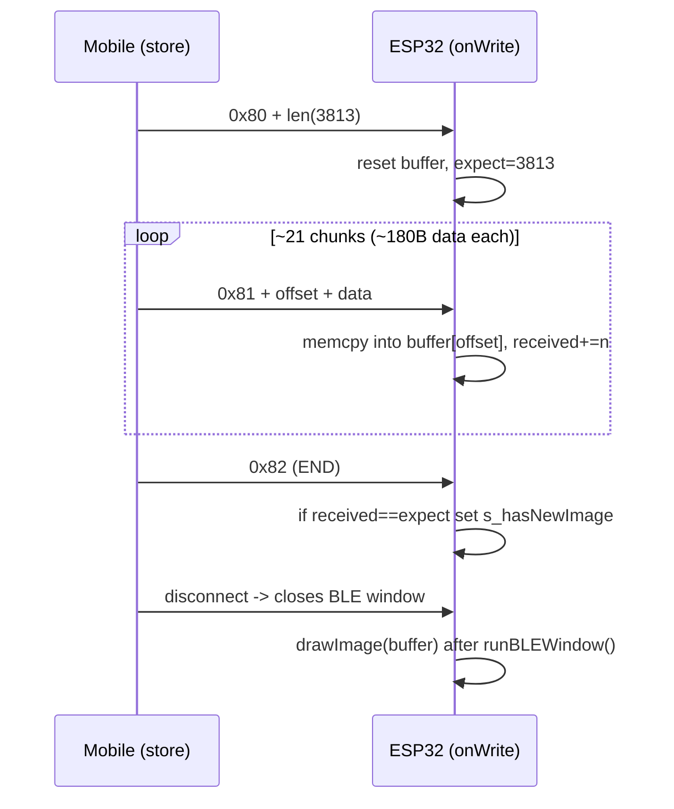

# BLE Image Transfer (250x122, 1bpp)

## Protocol design

The characteristic stays single (write-only). The first byte (control byte) MSB selects the path:
- MSB = 0 -> time (unchanged, `decodeTimeByte`)
- MSB = 1 -> image, with the lower 7 bits as opcode

Three opcodes (all with MSB set):
- `0x80` START: `[0x80][lenHi][lenLo]` — total image bytes (3813), resets the receive buffer
- `0x81` DATA: `[0x81][offHi][offLo][...payload...]` — payload copied at byte `offset`
- `0x82` END: `[0x82]` — validates byte count and triggers the render

Image format (confirmed): tight packing, no per-row padding, MSB-first, pixel index `i = y*250 + x`, `bit=1 -> NERO`. Total `ceil(250*122/8) = 3813` bytes.

## Mobile app — [mobile_app/src/stores/ble.store.js](mobile_app/src/stores/ble.store.js)

Add `async SEND_IMAGE(imageData)`:
- Expect an `ImageData`-like object (`{ width, height, data }`, RGBA). Guard `width===250 && height===122`.
- Threshold each pixel by luminance (`0.299R+0.587G+0.114B < 128` -> black -> bit 1; respect alpha=0 as white). Pack tightly into a `Uint8Array(3813)`, MSB-first, `idx=y*250+x`.
- Send sequentially (await each `BleClient.write`, write-with-response):
  - START `[0x80, len>>8, len&0xff]`
  - DATA in chunks of `CHUNK_DATA = 180` bytes: `[0x81, off>>8, off&0xff, ...slice]`
  - END `[0x82]`
- Reuse the existing `BLE_SERVICE_UUID` / `BLE_CHARACTERISTIC_UUID` and `connectedDevice` guard pattern from `SEND_TIME`.

## ESP32 firmware

### [esp32-parking-disk/src/main.cpp](esp32-parking-disk/src/main.cpp)
- Add constants `IMAGE_WIDTH=250`, `IMAGE_HEIGHT=122`, `IMAGE_BYTES=3813`.
- Add static state: `uint8_t s_imageBuf[IMAGE_BYTES]`, `size_t s_imageReceived`, `uint16_t s_imageExpected`, `volatile bool s_hasNewImage`.
- In `TimeCharCallbacks::onWrite`, branch on `val[0] & 0x80`:
  - not set -> existing time path (unchanged).
  - set -> switch on `val[0]`: START (reset counters), DATA (`memcpy(&s_imageBuf[offset], &val[3], len-3)` with bounds check, accumulate), END (`if (s_imageReceived == s_imageExpected) s_hasNewImage = true`).
- Raise MTU in `runBLEWindow()` via `BLEDevice::setMTU(247)` so ~180B writes fit.
- After `runBLEWindow()` in `setup()`, mirror the `s_hasNewTime` fallback: `if (s_hasNewImage)` call a thread-safe `safeDrawImage(s_imageBuf, IMAGE_BYTES)` (render after the BLE window closes, to avoid blocking the BLE stack during the slow full refresh).

### [esp32-parking-disk/include/display.h](esp32-parking-disk/include/display.h) + [esp32-parking-disk/src/display.cpp](esp32-parking-disk/src/display.cpp)
- Declare `void drawImage(const uint8_t* data, size_t len);`
- Implement: `initDisplay()`, `setFullWindow()`, `firstPage()/nextPage()` loop, `fillScreen(GxEPD_WHITE)`, then for each pixel decode the tightly-packed bit (`idx=y*250+x`, `bit=(data[idx>>3]>>(7-(idx&7)))&1`) and `display.drawPixel(x, y, GxEPD_BLACK)` when set; `hibernate()` at the end. Same structure as `updateNumber()`.

## Notes / assumptions
- Chunk size 180B is conservative for cross-platform MTU; can be bumped if negotiated MTU is higher.
- No CRC in v1 (END validates only total byte count); easy to add a checksum byte later if needed.
- The store assumes the caller already produced a 250x122 `ImageData`; resizing/rasterization (e.g. from a canvas) is the caller's responsibility.