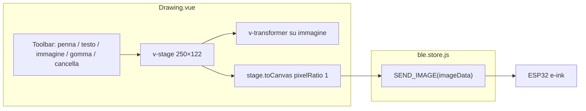

# Editor disegno e-ink con vue-konva

## Contesto

- [`mobile_app/src/views/Drawing.vue`](mobile_app/src/views/Drawing.vue) è un placeholder da sostituire.
- [`mobile_app/src/stores/ble.store.js`](mobile_app/src/stores/ble.store.js) espone già `SEND_IMAGE(imageData)` che accetta `ImageData` RGBA **esattamente 250×122** e fa threshold 1bpp prima dell'invio BLE.
- [`mobile_app/src/main.js`](mobile_app/src/main.js) registra già `VueKonva` — nessuna modifica di setup.
- [`mobile_app/src/views/ParkingDisk.vue`](mobile_app/src/views/ParkingDisk.vue) contiene il pattern del pulsante invio (stati loading/success/error, disabled se non connesso, hint "Nessun dispositivo connesso") da copiare.
- L'app gira su **Capacitor iOS/Android** (non desktop): tutte le interazioni devono essere pensate per il **touch**, con safe-area già gestita via [`capacitor.js`](mobile_app/src/capacitor.js) e variabili CSS `--safe-area-inset-*`.

## Mobile UX (Capacitor) — requisiti trasversali

### Layout verticale thumb-friendly

```
┌─────────────────────────┐
│ HeaderBar               │
├─────────────────────────┤
│ Toolbar (48px tap)      │  ← icone grandi, tool attivo evidenziato
├─────────────────────────┤
│ Canvas card (scaled up) │  ← area principale, bordo visibile
├─────────────────────────┤
│ Barra testo (se attivo) │  ← input + "Aggiungi", solo in modalità testo
├─────────────────────────┤
│ [flex spacer]           │
├─────────────────────────┤
│ Pulsante Invia (sticky) │  ← padding-bottom: safe-area
└─────────────────────────┘
```

- **Pulsante invio in fondo** alla schermata (come ParkingDisk), con `padding-bottom: calc(24px + var(--safe-area-inset-bottom))` per non finire sotto la home indicator iOS.
- **Nessuna dipendenza da hover**: feedback solo con `:active` e stato `.tool-btn--active`.

### Canvas: logico 250×122, visivo ingrandito

Il canvas Konva resta **250×122 px logici** (per export BLE corretto), ma il wrapper CSS lo scala per riempire la larghezza utile:

```css
.canvas-scaler {
  width: 100%;
  max-width: 500px;
  touch-action: none;        /* blocca scroll/zoom browser durante disegno */
  overscroll-behavior: contain;
  -webkit-user-select: none;
  user-select: none;
}
.canvas-scaler canvas {
  width: 100% !important;    /* scala visiva, coordinate Konva restano 250×122 */
  height: auto !important;
  display: block;
}
```

Su `touchmove` durante il disegno: `e.evt.preventDefault()` per evitare che la pagina scrolli mentre si traccia.

### Toolbar touch-friendly

- Pulsanti tool: **min 48×48 px** (standard iOS/Android), disposti in riga con `gap: 8px`, scroll orizzontale se necessario su schermi stretti.
- Icone SVG **24px**, etichetta testuale sotto l'icona opzionale (es. "Penna", "Testo") per chiarezza.
- Tool attivo: sfondo `#1a1a2e`, icona bianca; inattivo: sfondo bianco, bordo leggero.
- **"Cancella tutto"**: `confirm()` nativo prima di resettare (evita tap accidentali su mobile).

### Disegno e gomma ottimizzati per dito

- `strokeWidth: 3` (non 2) per tratti più visibili al dito.
- Gomma: `strokeWidth: 12` per area di cancellazione più ampia.
- Eventi: `@touchstart`, `@touchmove`, `@touchend` obbligatori oltre a mouse (già previsti).

### Testo: barra input mobile (al posto di `prompt()`)

`prompt()` è scomodo su WebView Capacitor. In modalità testo mostrare una **barra fissa sotto il canvas**:

- `<input type="text">` con `font-size: 16px` (evita zoom automatico iOS su focus)
- Pulsante "Aggiungi" — al tap sul canvas posiziona il testo alla coordinata del dito
- Flusso: (1) scrivi nella barra → (2) tap sul canvas per posizionare → testo aggiunto
- Hint sotto la barra: *"Scrivi il testo, poi tocca il canvas per posizionarlo"*

### Immagine: picker nativo + maniglie touch

- `<input type="file" accept="image/*">` apre il **selettore foto nativo** iOS/Android in Capacitor (nessun plugin aggiuntivo).
- Maniglie transformer ingrandite per il dito:
  ```javascript
  anchorSize: 18,
  anchorCornerRadius: 9,
  borderStrokeWidth: 2,
  padding: 4,  // area di hit più ampia attorno all'immagine
  ```
- Con tool `image` attivo, tap sull'immagine la seleziona; drag e resize funzionano con touch.

### Prevenzione conflitti touch

- In modalità penna/gomma: `draggable: false` su testo e immagine (evita drag accidentale mentre si disegna).
- In modalità testo: solo posizionamento al tap; testo esistente draggable per riposizionarlo.
- In modalità immagine: solo immagine interattiva; transformer attivo.

## Architettura



## Implementazione in Drawing.vue

### Costanti e stato

```javascript
const CANVAS_W = 250;
const CANVAS_H = 122;
const BLACK = "#000000";
const WHITE = "#ffffff";
```

Stato reattivo:
- `tool`: `'pen' | 'text' | 'image' | 'eraser'`
- `lines`: array di `{ tool, points }` (pattern free-drawing Konva)
- `texts`: array di `{ id, x, y, text }`
- `textDraft`: stringa nella barra input testo (mobile)
- `imageNode`: singolo oggetto `{ id, x, y, width, height, image, name }` oppure `null` (sostituisce la precedente)
- `isDrawing`, `isSending`, `sendSuccess`, `sendError`
- `stageRef`, `transformerRef`, `imageRef` per export, pointer events e transformer
- `fileInputRef` per picker immagini nascosto

### Canvas Konva (250×122 logici)

```vue
<v-stage ref="stageRef" :config="{ width: CANVAS_W, height: CANVAS_H }" ...>
  <v-layer>
    <v-rect :config="{ x:0, y:0, width:CANVAS_W, height:CANVAS_H, fill:WHITE }" />
    <v-image
      v-if="imageNode"
      ref="imageRef"
      :config="imageNode"
      :draggable="tool === 'image'"
      @transformend="onImageTransformEnd"
    />
    <v-line v-for="(line, i) in lines" :key="'l'+i" :config="lineConfig(line)" />
    <v-text v-for="t in texts" :key="t.id" :config="textConfig(t)" :draggable="tool !== 'pen' && tool !== 'eraser'" />
    <v-transformer
      ref="transformerRef"
      :config="{
        rotateEnabled: false,
        enabledAnchors: ['top-left', 'top-right', 'bottom-left', 'bottom-right'],
        boundBoxFunc: imageBoundBox,
      }"
    />
  </v-layer>
</v-stage>
```

Regole bianco/nero:
- Sfondo bianco fisso.
- Penna e testo: `#000000`.
- Gomma: `globalCompositeOperation: 'destination-out'`.
- Immagini importate: preprocessate a bianco/nero **prima** di essere aggiunte al layer (WYSIWYG con l'e-ink).

### Immagine: trascinabile + ridimensionabile con maniglie

Usare `v-transformer` di vue-konva (pattern ufficiale Konva):

1. **Selezione automatica**: quando `tool === 'image'` e `imageNode` è presente, collegare il transformer al nodo immagine:
   ```javascript
   function updateTransformer() {
     const tr = transformerRef.value?.getNode();
     const img = imageRef.value?.getNode();
     if (tool.value === 'image' && img) {
       tr.nodes([img]);
     } else {
       tr.nodes([]);
     }
     tr?.getLayer()?.batchDraw();
   }
   ```
   Chiamare `updateTransformer` dopo caricamento immagine, cambio tool, e `watch(imageNode)`.

2. **Maniglie agli angoli**: `enabledAnchors: ['top-left', 'top-right', 'bottom-left', 'bottom-right']` — niente rotazione (`rotateEnabled: false`).

3. **Limiti resize** via `boundBoxFunc`:
   - Dimensione minima: 20×20 px
   - Bounding box entro il canvas 250×122 (non uscire dai bordi)

4. **Persistenza dimensioni** su `@transformend`:
   ```javascript
   function onImageTransformEnd(e) {
     const node = e.target;
     imageNode.value = {
       ...imageNode.value,
       x: node.x(),
       y: node.y(),
       width: node.width() * node.scaleX(),
       height: node.height() * node.scaleY(),
       scaleX: 1,
       scaleY: 1,
     };
   }
   ```
   Reset `scaleX/scaleY` a 1 e applicare la scala a `width/height` (best practice Konva per evitare scale accumulate).

5. **Interazione tool**: con tool `image` l'immagine è draggable e il transformer mostra le maniglie; con altri tool il transformer è staccato (nessuna maniglia visibile) per non interferire con disegno/testo.

6. **Una immagine alla volta**: nuova importazione sostituisce `imageNode` e riattacca il transformer.

### Toolbar strumenti

| Strumento | Comportamento |
|-----------|---------------|
| **Penna** | Freehand nero, `strokeWidth: 3`; touch con `preventDefault` anti-scroll |
| **Testo** | Barra input sotto canvas → tap per posizionare; testo draggable in modalità testo |
| **Immagine** | Tap tool → file picker nativo; BW + fit iniziale; sostituisce precedente; drag + resize con maniglie touch (18px) |
| **Gomma** | Cancella tratti, `strokeWidth: 12` |
| **Cancella tutto** | `confirm()` poi reset completo |

### Preprocessing immagine (BW, fit 250×122)

Funzione helper locale `loadBwImage(file)`:
1. `FileReader` → `HTMLImageElement`
2. Canvas offscreen 250×122, sfondo bianco
3. `drawImage` con scale `min(250/w, 122/h)` centrato
4. Threshold a bianco/nero puro
5. Risultato usato come `image` di `Konva.Image` con `width`/`height` iniziali dal fit

L'utente può poi ridimensionare liberamente con le maniglie; l'export finale rasterizza lo stato visivo del canvas.

### Export per BLE

```javascript
function exportImageData() {
  const stage = stageRef.value.getNode();
  const canvas = stage.toCanvas({ pixelRatio: 1 });
  return canvas.getContext("2d").getImageData(0, 0, CANVAS_W, CANVAS_H);
}
```

`pixelRatio: 1` garantisce dimensioni esatte richieste da `SEND_IMAGE`. Il transformer viene incluso nell'export solo se le maniglie sono sul layer — **nascondere il transformer prima dell'export** (`transformerRef.getNode().nodes([])` o `visible(false)`) per non includere le maniglie nell'immagine inviata.

### Pulsante invio (copia da ParkingDisk)

Copiare template + stili `.send-btn`, `.btn-inner`, `.spinner`, `.no-device-hint` da [`ParkingDisk.vue`](mobile_app/src/views/ParkingDisk.vue), adattando le etichette:

- Default: **"Invia immagine"**
- Loading: **"Invio in corso…"**
- Success: **"Immagine inviata"**
- Error: **"Errore invio"**

Handler chiama `bleStore.SEND_IMAGE(exportImageData())` con gli stessi stati `isSending` / `sendSuccess` / `sendError`.

### Piccola modifica a ble.store.js

`SEND_IMAGE` deve rilanciare errori (`throw`) per far funzionare il feedback del pulsante (oggi logga e inghiotte).

### Layout e stile (mobile-first)

- Shell allineata a ParkingDisk (`background: #f7f4ef`, `width: min(100%, 500px)`)
- Card bianca attorno al canvas con bordo visibile (aiuta a capire i limiti dell'e-ink)
- Toolbar: pulsanti 48px, gap generoso, nessun hover
- Canvas wrapper con `touch-action: none` e scale CSS al 100% larghezza
- Barra testo: appare solo con `tool === 'text'`, input `font-size: 16px`
- Pulsante invio: full-width, sticky in fondo, safe-area bottom
- Maniglie transformer: `anchorSize: 18`, colori `#1a1a2e` / `#fff`

## File toccati

| File | Modifica |
|------|----------|
| [`mobile_app/src/views/Drawing.vue`](mobile_app/src/views/Drawing.vue) | Editor completo + transformer immagine + invio |
| [`mobile_app/src/stores/ble.store.js`](mobile_app/src/stores/ble.store.js) | `SEND_IMAGE` rilancia errori |

## Test manuale (su device Capacitor)

1. **Penna**: disegnare col dito senza scroll accidentale della pagina.
2. **Testo**: scrivere nella barra, tap sul canvas per posizionare, riposizionare col drag.
3. **Immagine**: picker nativo foto → fit BW → drag e resize con maniglie al dito.
4. **Gomma**: cancellare tratti con area ampia.
5. **Cancella tutto**: conferma dialog, poi reset.
6. **Invio BLE**: pulsante raggiungibile col pollice, safe-area rispettata, immagine su e-ink senza maniglie.
7. **Rotazione device**: layout stabile in portrait (priorità); landscape accettabile.
